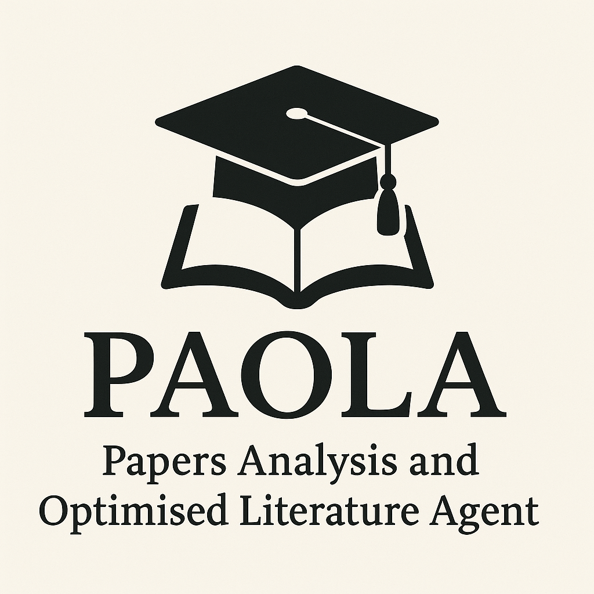
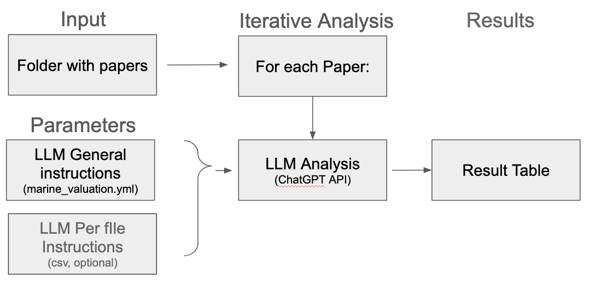
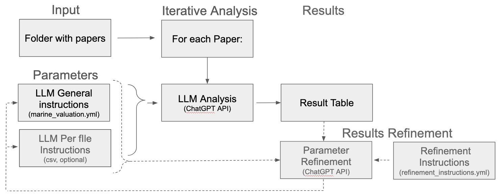

# Papers Analysis and Optimised Literature Agent (P.A.O.L.A.) v.0.1.0
 

A small toolkit to **score relevance** and **extract structured fields** from scientific PDFs
(e.g., *marine invasive alien species* in the Mediterranean) using an LLM + lightweight RAG.
It supports **OpenAI**, **other API providers** (e.g., DeepSeek), and **local LLMs** via **Ollama**.


## Download the files
Go to the directory you want to use the program.
Download the code (is in the code section), or use the command
   ```bash
git clone https://github.com/mauromaiorca/agents_LLM
cd agents_LLM/MIAS
   ```
So, you are in your MIAS directory, assume your directory is this: "/home/mauro/test/testLLM/agents_LLM/MIAS"
You should see three directories (analysis, code, docs, and template_instructions). In code there is the actual program, in analysis is where the results are going to be saved, docs is the guide to use the program (you can find this page there as README.md), and in template_instructions you will find template infos.

## Get ChatGPT API
You need to have ChatGPT API, unfortunately this might not be free.
Instructions here: [https://platform.openai.com/](https://platform.openai.com/docs/quickstart)
   
## Setup ChatGPT API

In the directory where you are going to use the code, create a file named .env that will look like:
   ```bash
OPENAI_API_KEY=YOUR-API-KEY
OPENAI_MODEL=gpt-4o-mini
   ```
and replace "YOUR-API-KEY" with your api key retrieved from OpenAI. Also, it should be possible use other LLM, but I didn't test on that. Further, here the gpt-4o-mini is used because it's cheap, see pricing here: [openAI pricing](https://platform.openai.com/docs/pricing), you can also go for a cheaper gpt-5-nano, or slightly more expensive gpt-5-mini.
Assume the directory you are using the code is 

## Install
Be sure you are in the "agents_LLM/MIAS" folder (you will run program from here). 
To don't mess with other installation in your system create an environment, source it, activate, install required software. 
So, in the directory "agents_LLM/MIAS" do this:
   ```python3 -m venv .venv
source .venv/bin/activate
pip install --upgrade pip
pip install -r code/requirements.txt
chmod +x code/run_pdf_relevance_pipeline.py
chmod +x code/profile_refinement_agent.py
   ```
You should now be ready to use the program "./code/run_pdf_relevance_pipeline.py "

If you are using windows or other systems other than linux or mac, you might have a look here [`docs/Installation.md`](docs/Installation.md) for inspiration. However, this specific installation has been tested in linux only.

## Run the program
Always be sure that your environment is activated, so go to your home directory (e.g. cd /home/mauro/test/testLLM/agents_LLM/MIAS/), and do 
   ```deactivate
source .venv/bin/activate
   ```
So you are ready to run the program. This is a brief schema of the mechanisms:

 

To run, be sure you have a directory with the pdf you want to check (for example assume the directory for your documents is in /home/mauro/test/testLLM/agents_LLM/MIAS/documents), for this example I used the documents here: [random MIAS papers](https://drive.google.com/drive/folders/1ApNg5qFHohkLq_uXEiH0Ow-na8fnDgzt?usp=sharing), and you also need to have the initial template instructions (template_instructions/marine_valuation.yml), and you will have the results in analysis/result_table.csv


To run the program:
   ```bash
   ./code/run_pdf_relevance_pipeline.py --pdf-dir /home/mauro/test/testLLM/agents_LLM/MIAS/documents --config template_instructions/marine_valuation.yml --out-csv analysis/result_table.csv
   ```
this will produce a directory and a file that looks : [/home/mauro/test/testLLM/agents_LLM/MIAS/documents/analysis/extractions_from_pdfs.csv](analysis/extractions_from_pdfs.csv)


## Automatically refine the instructions and re-run the program 
The task to perform for the agents are in the file "marine_valuation.yml". This file is not pefect, and you need to adjust it to what you are interested to. Also, every paper is different, and the algorithm might want to look for specific details in some of the papers.

This is a brief schema of the mechanisms:

 

In that case you can run
```bash
./code/profile_refinement_agent.py --csv code/extractions_from_pdfs.csv --instructions template_instructions/refinement_instructions.yml --base-profile template_instructions/marine_valuation.yml --o-basename analysis/marine_valuation_v2
```
to get a better version of the marine_valuation_v2.yml using the collected data and the table. And per-file csv instructions, marine_valuation_v2.csv with specific per-file instructions on the findings.

You can then call again ./code/run_pdf_relevance_pipeline.py and hopefully you will get a better analysis table: analysis_run2.csv
```bash
./code/run_pdf_relevance_pipeline.py --pdf-dir documents --config analysis/marine_valuation_v2.yml --actions-csv analysis/marine_valuation_v2.csv --out-csv analysis/analysis_run2.csv
```

this will produce a directory and a file that looks : [/home/mauro/test/testLLM/agents_LLM/MIAS/documents/analysis/analysis_run2.csv](analysis/analysis_run2.csv)
that hopefully has more informative fields.

## Other uses
If you want to produce json files of papers structured (using grobid), use this command:
```bash
code/run_pdf_relevance_pipeline.py --pdf-dir techAndMarketing_docs/ --config template_instructions/scontrini_instructions.yml --out-csv analysis/instruction_papers.csv --out-metadata-basedir techAndMarketing_json --docs-type paper
```

If you want to enrich json files of papers structured (using grobid), use this command:
```bash
./code/parse_documents.py --docs-dir cryoEM_documents/  --enrich template_instructions/enrich_instruction_file.yml --out-json-dir cryoEM_enriched_json/ --docs-type paper
```

If you got png or jpg receipts in a folder, you can run the program with this parameters:
```bash
code/run_pdf_relevance_pipeline.py --png-dir scontrini/ --config template_instructions/scontrini_instructions.yml --out-csv analysis/scontrini_new.csv --docs-type receipts
```
and you will get a csv with the receipts total amount: "analysis/scontrini_new.csv":


## Optional third parts  

The above software converts a pdf into a text file before submitting it to LLM for analysis. However, this might not be the best way to handle scientific documents that are often complex and hetereogeneous. For this reason, we can offer the interface with grobbid (https://github.com/kermitt2/grobid), a machine learning library for extracting, parsing and re-structuring raw documents such as PDF into structured XML/TEI encoded documents with a particular focus on technical and scientific publications. To use that option (--docs-type paper), you need to locally install grobbid following instructions here: (https://github.com/kermitt2/grobid). One idea is to install docker, and then run "docker run --rm -it -p 8070:8070 lfoppiano/grobid:0.7.3"
